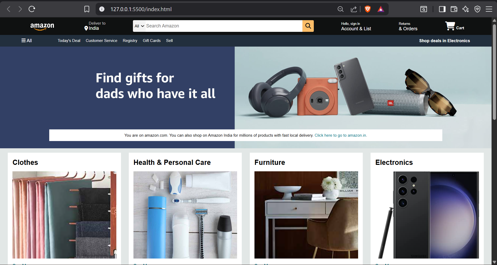
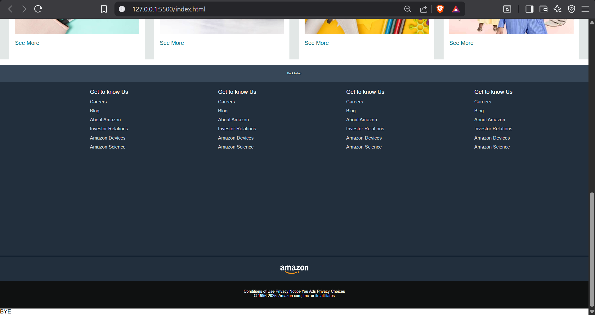

# Amazon Homepage Clone

This project is a static, visual clone of the Amazon e-commerce homepage, built entirely with **HTML** and **CSS**. It demonstrates front-end development skills by replicating the layout and styling of a major website.

## 🚀 Features

* **Navigation Bar:** A complete replica of the Amazon navbar, including the logo, delivery address, search bar, sign-in, returns, and cart.
* **Hero Section:** The main banner image and message area.
* **Product Grid:** A responsive grid layout showcasing different product categories in "shop-section" boxes.
* **Footer:** A detailed, multi-part footer with navigation links, matching the original site's structure.

## 🛠️ Technologies Used

* **HTML5:** For the structure and content of the webpage.
* **CSS3:** For all styling, layout (using Flexbox), and responsiveness.
* **Font Awesome:** For icons used in the navigation bar and buttons.

## 📸 Preview

